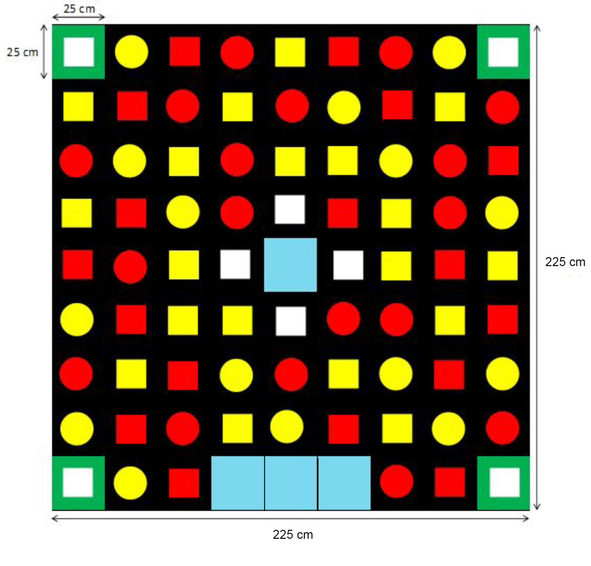
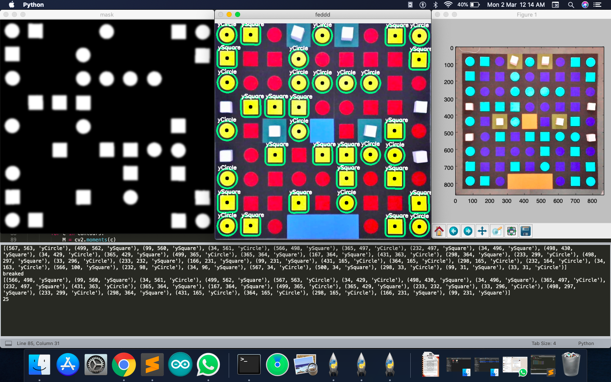

## Autonomous Navigation Bot — Winning solution of Technex '20
### &nbsp;&nbsp;&nbsp;&nbsp;&nbsp;&nbsp;&nbsp;&nbsp;&nbsp;&nbsp;&nbsp;&nbsp;&nbsp;&nbsp;&nbsp;&nbsp;&nbsp;&nbsp;&nbsp;&nbsp;&nbsp;&nbsp;&nbsp;&nbsp;&nbsp;&nbsp;&nbsp;&nbsp;&nbsp;&nbsp;&nbsp;&nbsp;&nbsp;&nbsp;&nbsp;&nbsp;&nbsp;&nbsp;&nbsp;&nbsp;&nbsp;&nbsp;&nbsp;&nbsp;&nbsp;&nbsp;&nbsp;&nbsp;&nbsp;&nbsp;&nbsp;&nbsp;&nbsp;&nbsp;&nbsp;&nbsp;&nbsp;&nbsp;&nbsp;&nbsp;&nbsp;&nbsp;&nbsp;&nbsp;&nbsp;&nbsp;&nbsp;&nbsp;&nbsp;&nbsp;&nbsp;&nbsp;&nbsp;&nbsp;&nbsp;&nbsp;&nbsp;&nbsp;&nbsp;&nbsp;&nbsp;&nbsp;&nbsp;&nbsp;&nbsp;&nbsp;&nbsp;&nbsp;&nbsp;&nbsp;&nbsp;&nbsp;&nbsp;&nbsp;&nbsp;&nbsp;&nbsp;&nbsp;&nbsp;&nbsp;&nbsp;&nbsp;&nbsp;&nbsp;&nbsp;&nbsp;&nbsp;&nbsp;&nbsp;&nbsp;&nbsp;&nbsp;&nbsp;&nbsp;&nbsp;&nbsp;&nbsp;&nbsp;&nbsp; — Team Sectumsempra

Using the principles of Image processing, the bot deciphers the arena grids that are covered with blocks of varying shapes and colors. It then identifies the shortest path using **Dijkstra's Algorithm** and traverses along it in order to perform the tasks of the problem statement.

## Problem Statement

      
You can find the problem statement here —— 
         <a href="problem_statement.pdf" onclick="window.open(this.href,'_blank');return false;">Problem Statement </a>
      

    

#### Arena:

The arena contains 9 * 9 grids of varying shapes and colors as shown in the image below:

&nbsp;&nbsp;&nbsp;&nbsp;&nbsp;&nbsp;&nbsp;&nbsp;&nbsp;&nbsp;&nbsp;&nbsp;&nbsp;&nbsp;&nbsp;&nbsp;&nbsp;&nbsp;&nbsp;&nbsp;&nbsp;&nbsp;&nbsp;&nbsp;&nbsp;&nbsp;&nbsp;&nbsp;&nbsp;&nbsp;&nbsp;&nbsp;&nbsp;&nbsp;&nbsp;&nbsp;&nbsp;&nbsp;&nbsp;&nbsp;&nbsp;&nbsp;&nbsp;&nbsp;&nbsp;&nbsp;&nbsp; 

     
      </a>
    

#### Key:

- Blue blocks — Azkaban Prison.
- White blocks — Death eaters guarding the horcruxes or Weapons guarding the identity of the horcrux that a particular weapon can destroy.
- Remaining blocks — Distractions that have the identity of horcruxes i.e., fake horcruxes to distract the bot.

#### PS in brief:

The bot should use the feed from the camera that is overhead the arena. It should then identify the death eaters and transfer them to the Azkaban prison in order to reveal the horcruxes underneath. The bot should remove the weapon blocks and uncover the identity of the horcrux that the weapons can destroy. It should then deliver the weapon blocks to their respective horcruxes in order to destory them. 

#### Indicators:

- Blue LED — When a death eater is placed in the Azkaban cell.
- Green LED — When a weapon is picked.
- Red LED — When a weapon is delivered to its respective horcrux.

## Team Sectumsempra Solution

1. The bot uses the feed from the overhead camera and applies image processing techniques to decipher the arena grids and segragate them into groups of varying colors and shapes.
2. A (9 * 9) will be created to represent the arena. A unique number is assigned to each of the blocks of a particular shape and color. 
3. As the optimal scoring trajectory is along the path of least distractions (i.e., if the target horcrux is red circle, the bot should traverse along the path of least red circles but also in the quickest time), therefore, the grids containing same color and shape as the horcrcux are given lower priority values in the matrix.
4. Dijkstra's algorithm is implemented on the obtained matrix and the shortest path is determined. The bot then traverses along the shortest path to fulfil the task.
5. After the task is fulfilled, the matrix values get reassigned for the next task. This process continues till all the tasks are completed i.e., all the death eaters are transferred to the prison and the horcruxes are destroyed using the weapons.
6. Aruco marker and PID control system are used to make the bot traverse in a straight line and take sharp 90 degree turns.

## Final Run:

#### Final Event Video:

      
    

#### Background Processing:

     
      </a>
    

    
#### Shortest Path Generated using Dijkstra's Algorithm:

     
      </a>
    

